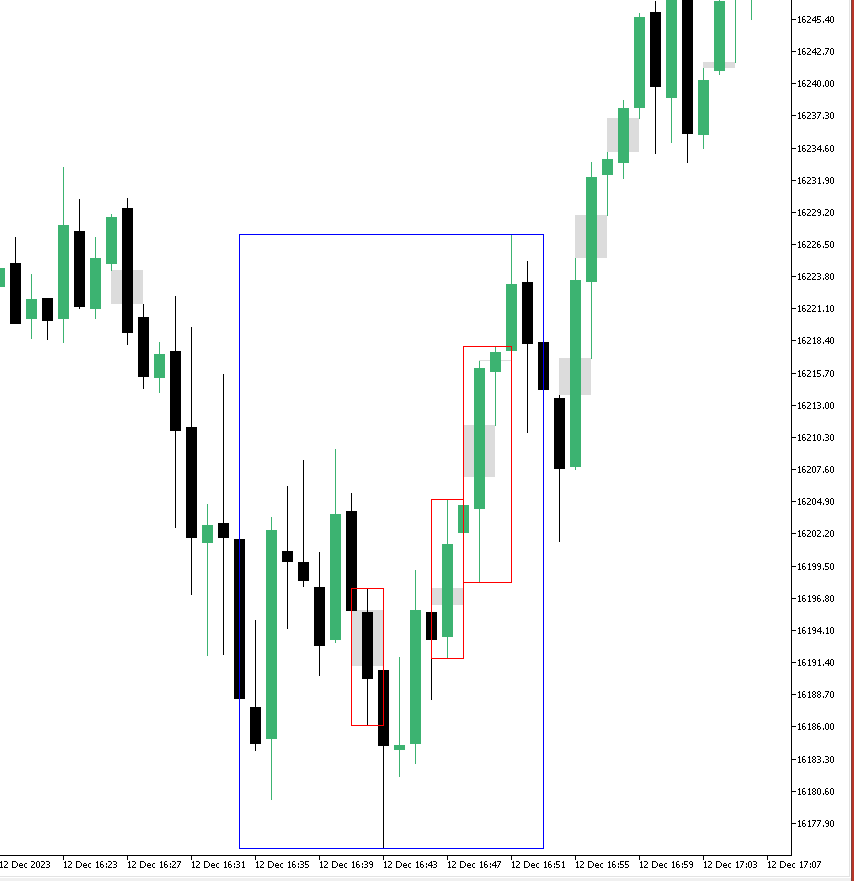

# TradeQL

> A regex-inspired query language for the description and analysis of candlestick chart patterns in trading.

## Introduction

Here we present a Domain-Specific Language (DSL) designed specifically for the description of trading patterns in candlestick charts. This DSL enables traders and analysts to articulate trading scenarios with a level clarity and brevity similar to regular expressions used in programming.

## Basic Elements

### Patterns

- **Imbalance `I`:** Represents a bar with a price imbalance.
- **Bar `B`:** A standard bar without specific characteristics.
- **Pin `P`:** A bar with a long wick, indicative of a pinbar or doji.

### Direction

TradeQL is designed to describe the pattern's direction relative to an already established or known trend, without inherently specifying the trend's bullish or bearish nature.

- **Forward `f`:** Indicates a pattern moving _along_ with the known trend, regardless of whether the trend is bullish or bearish.
- **Reverse `r`:** Indicates a pattern moving _against_ the known trend, again without specifying if the trend is bullish or bearish.

### Quantifiers

Quantifiers follow the direction and specify the quantity:

- **0 or more `*`:** An unspecified number of occurrences, including none.
- **1 or more `+`:** At least one occurrence.
- **Specific amount `{n}`:** Exactly 'n' occurrences, where 'n' is a number.

### Meta-Patterns

> Optional. Not implemented on v1.

- **Forward Consolidation `C+f`:** Equivalent to a series of bars in any direction or forward imbalances during a forward direction, denoted as `(Bf|Br|If)+`.
- **Reverse Consolidation `C+r`:** Equivalent to a series of bars in any direction or reverse imbalances during a reverse direction, denoted as `(Bf|Br|Ir)+`.
- **Neutral Consolidation `C+`:** A series of bars in either forward or reverse directions, without imbalances, denoted as `(Bf|Br)+`.

### Additional Syntax

- **Alternation `|`:** Used to denote a choice between different patterns or directions.
- **Grouping `()`:** Used to group patterns and directions together for combined interpretation.
- **Sequence Indicator `>`:** Denotes the sequence in which patterns should occur.

### Syntax Rules

- Patterns can be combined with directions and then quantifiers.
- Meta-patterns provide shorthand notation for common complex sequences.
- Alternation and grouping allow for the description of complex and varied patterns.
- The sequence indicator is essential for defining the order of occurrence of patterns.

## Examples

### Simple Patterns

- **`Bf+`:** A series of forward bars
- **`Pr{2}`:** At least two reverse pinbars

### Complex Pattern

- **`(If+|Pr+)>Cf*>Ir+>Cf+>Ir+`:** This pattern represents a sequence where the first stage is either one or more forward imbalances `If+` or a reverse pinbar `Pr+`, followed by any number of forward consolidations `Cf*`, then one or more reverse imbalances `Ir+`, followed by one or more forward consolidations `Cf+`, and finally, one or more reverse imbalances `Ir+` again.

## API

### `TradeQL.match`

Matches a TradeQL query against a sequence of bars given a trend.

#### Parameters

- `query` (`string`): The TradeQL query string.
- `bars` (`srray` of `Bar`): An array of `Bar` objects, each with `open`, `close`, `high`, `low` properties of type `double`.
- `trend` (`Trend`): The market trend, either bullish or bearish.

#### Returns

- An array where each element is a `Match` object. The structure of each `Match` object is:
  - `startPos` (`integer`): The starting position of the match or group in the sequence.
  - `endPos` (`integer`): The ending position of the match or group in the sequence.

#### Example Usage

```c
query = "(If|Pr)+>Cf*>Ir+>Cf+>Ir+";
bars = [{ open: ..., close: ..., high: ..., low: ... }, ...];
trend = "bullish"; // or "bearish"

matches = TradeQL.match(query, bars, trend);
print(matches[0]); // { startPos: ..., endPos: ... } - full match
print(matches[1]); // { startPos: ..., endPos: ... } - first captured group, if present
print(matches[2]); // { startPos: ..., endPos: ... } - second captured group, if present
```

#### Notes:

- The first element of the matches array represents the full match of the query.
- Subsequent elements represent captured groups within the query, if present.
- This structure allows users access the start and end positions of both the full match and any sub-patterns captured by groups.

### `TradeQL.Imbalance`

Allows users to define custom logic for detecting imbalances in a bar.

#### Parameters

- `index` (`integer`): The index of the bar in the sequence to inspect for imbalance.

#### Returns

- (`boolean`): Returns `true` if the bar at the specified index has price imbalance, otherwise `false`.

#### Example Usage

```c
TradeQL.Imbalance = function(index) {
    bar = this.getBar(index);
    hasImbalance = false;
    /* Define custom logic to determine an imbalance */
    return hasImbalance;
};
```

### `TradeQL.Pinbar`

This function enables users to define custom logic for identifying pinbars within a bar sequence.

#### Parameters

- `index` (`integer`): The index of the bar in the sequence to be checked for being a pinbar.

#### Returns

- (`Array`): Returns an array with two elements:
  - `isPinbar` (`boolean`): `true` if the bar at the specified index is identified as a pinbar, otherwise `false`.
  - `withDirection` (`boolean`): `true` if the pinbar is aligned with the current trend direction, otherwise `false`.

#### Example Usage

```c
TradeQL.Pinbar = function(index) {
    bar = this.getBar(index);
    isPinbar = false;
    withDirection = false;
    /* Define custom logic to identify a pinbar */
    return [isPinbar, withDirection];
};
```

#### Notes

- **Pinbar Characteristics:** A pinbar is characterized by a very long wick on one side, a very small body, and a very small wick on the opposite side. The direction of the long wick relative to the trend is crucial for analysis.
- **Directional Significance:**
  - In a bullish trend, a pinbar with the long wick on the high side (upper wick) is considered "against the trend" or a "rejection pinbar". It suggests rejection of higher prices or a potential bearish reversal.
  - Conversely, in a bearish trend, a pinbar with the long wick on the low side (lower wick) would be "against the trend" and might indicate a rejection of lower prices or a potential bullish reversal.
- **Implementation in TradeQL.Pinbar:**
  - When implementing the TradeQL.Pinbar function, users should consider the trend context to determine if the pinbar is 'with direction' or 'against direction'.
  - The `withDirection` boolean should reflect whether the pinbar aligns with or opposes the current trend, based on the orientation of its long wick.
- **Example:** A pinbar that goes withDirection is one where the orientation of its long wick aligns with the current market trend, suggesting a continuation of that trend. For example, given a bullish trend, a pinbar `withDirection=true` is a pinbar where the long wick is on the Low side.

### Utility Functions

TradeQL provides a few key utility functions within its framework to facilitate the analysis of trading bar sequences.

#### `this.getBar(index)`

- **Functionality:** Provides access to a specific `Bar` object in the sequence, identified by its index.
- **Parameter**
  - `index` (`integer`): The index of the bar in the sequence.
- **Return Type:** `Bar` object.
- **Usage:** Useful for targeted analysis of a single bar and their properties like open, close, high, and low values.

#### `this.getTrend`

- **Functionality:** Retrieves the current market trend being used in the TradeQL analysis.
- **Return Type:** `Trend`, which is a string value, typically either 'bullish' or 'bearish'.
- **Usage:** This function is used to obtain the trend context in which the TradeQL analysis is being performed.

# Implementation

## MQL4/5 Usage

To use, first initialize a array of `Bar` objects with your data.
Then instantiate a `TradeQL` object with the bars and trend.
Finally, execute the query with the `Match` function.
The first match is the full match, and subsequent matches are captured groups if defined in the query.

```c++
#include <TradeQL.mqh>

void OnStart() {
    // Define the bars and trend
    CArrayObj *bars = ...; // Initialize with your bar data
    Trend trend = TREND_BULLISH; // or TREND_BEARISH

    // Instantiate TradeQL
    TradeQL tradeQL(bars, trend);

    // Define a TradeQL query
    string query = "B+>(If+)";

    // Execute the query
    CArrayObj *matches = new CArrayObj();
    tradeQL.Match(query, matches);

    // Process the results
    for (int i = 0; i < matches.Total(); i++) {
        Match *match = (Match *)matches.At(i);
        Print("Match from bar ", match.GetStart(), " to bar ", match.GetEnd());
    }

    // Cleanup
    delete matches;
}
```

More examples can be found in the [`/Scripts`](Scripts/) folder.

# DEMO

A simple indicator has been implemented to showcase how TradeQL can be used. This indicator uses TradeQL to identify and highlight candlestick a pattern on the chart based on a user-defined query. To use, simply click on the chart, and the pattern will be applied to the next few bars. Captured groups are highlighted.

- Trend: `Bullish`
- Query: `B*>(If)+>B*>(Ir)+>B*>(Ir)+>B*`
- Bars: `20`



The blue square shows the full match, and the red squares show the captured groups. In the query we are capturing two groups, the first one is `(If)+` (one or more forward imbalances) and the second one is `(Ir)+` (one or more reverse imbalances). The captured groups are highlighted in red.

If there are no matches, the indicator will simply show a black box around the target bars.

> NOTE: Gray boxes are provided by another indicator and are not part of this demo indicator. These are used to highlight imbalances.
